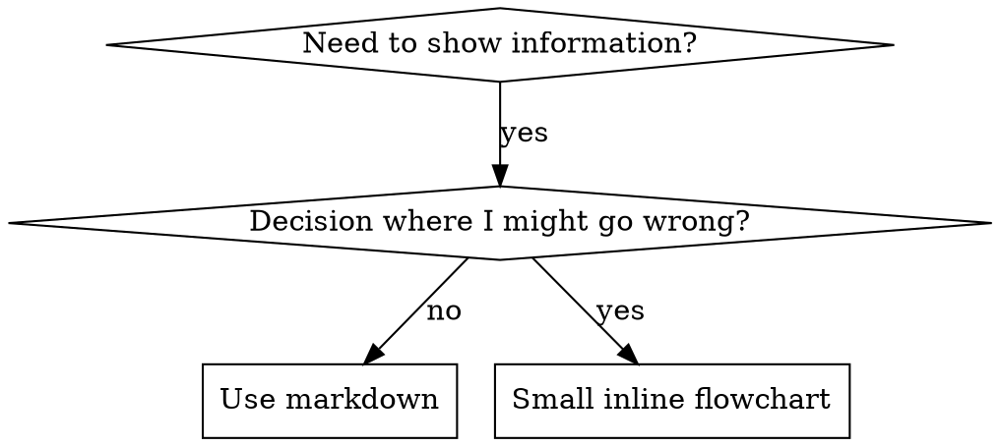

# Consolidated Skill: writing-assistant


## --- Original Skill: writing ---

# Writing

All writing modes under one skill: docs, plans, internal comms, and skill content.

## Mode Selection

```
Writing a document, proposal, spec, or RFC?   → DOC mode
Writing an implementation plan for code?       → PLAN mode
Writing internal comms, status updates, FAQs?  → COMMS mode
Writing or editing a SKILL.md file?            → SKILL CONTENT mode
```

---

## DOC MODE
*Co-author documentation through structured 3-stage workflow*

**Offer the workflow upfront.** Explain the three stages. If user declines, work freeform.

### Stage 1: Context Gathering
Ask meta-questions first:
1. What type of doc? (spec, decision doc, proposal, RFC)
2. Who's the audience?
3. What's the desired impact?
4. Template or format to follow?

Then encourage an **info dump** — background, alternatives considered, team dynamics, timeline pressures, technical dependencies. Don't organize yet, just get it all out.

Follow up with 5–10 numbered clarifying questions. User can answer in shorthand.

If integrations are available (Drive, Slack, etc.) — use them to pull context directly.

### Stage 2: Refinement & Structure
Build section by section:
1. Ask 5–10 clarifying questions about the section
2. Brainstorm 5–20 options for what to include
3. User curates (keep/remove/combine)
4. Gap check — anything missing?
5. Draft the section
6. Iterate via surgical edits until user is satisfied

Start with the section that has the most unknowns (core proposal for decision docs, technical approach for specs).

Use `str_replace` for edits — never reprint the whole doc.

**After 3 iterations with no substantial changes:** ask if anything can be removed.

### Stage 3: Reader Testing
Test with a fresh Claude that has no context from this conversation.

**Predict reader questions** → test them with a sub-agent (or ask user to test manually in a new chat) → surface gaps → loop back to refinement for any sections that fail.

**Exit condition:** Reader Claude consistently answers questions correctly without new gaps.

---

## PLAN MODE
*Write comprehensive implementation plans for multi-step code tasks*

Announce: "I'm using the writing skill to create the implementation plan."

**Context:** Run in a dedicated worktree (set up by dev-workflow skill first).
**Save to:** `docs/superpowers/plans/YYYY-MM-DD-<feature-name>.md`

### Before Writing
- If spec covers multiple independent subsystems → suggest breaking into sub-project plans
- Map out which files will be created/modified and their responsibilities first
- Design units with clear boundaries; files that change together should live together

### Plan Structure

**Required header:**
```markdown
# [Feature Name] Implementation Plan

> **For agentic workers:** REQUIRED SUB-SKILL: Use agent-orchestration (SUBAGENT DEV mode).

**Goal:** [One sentence]
**Architecture:** [2-3 sentences]
**Tech Stack:** [Key technologies]
---
```

**Each task:**
```markdown
### Task N: [Component Name]

**Files:**
- Create: `exact/path/to/file.py`
- Modify: `exact/path/to/existing.py:123-145`
- Test: `tests/exact/path/to/test.py`

- [ ] **Step 1: Write the failing test**
[actual test code here]

- [ ] **Step 2: Run test to verify it fails**
Run: `pytest tests/path/test.py::test_name -v`
Expected: FAIL with "[message]"

- [ ] **Step 3: Write minimal implementation**
[actual implementation code here]

- [ ] **Step 4: Run test to verify it passes**

- [ ] **Step 5: Commit**
`git commit -m "feat: [description]"`
```

### Plan Quality Rules
**Never write:** "TBD", "TODO", "implement later", "add appropriate error handling", "similar to Task N", steps without actual code.

Every step must contain what an engineer needs. If a step changes code, show the code.

### Self-Review After Writing
1. Spec coverage — can you point to a task for every requirement?
2. Placeholder scan — any red flags from the rules above?
3. Type consistency — do function names/types match across tasks?

**Execution handoff:** After saving, offer subagent-driven (recommended) vs inline execution via agent-orchestration skill.

---

## COMMS MODE
*Internal communications — status reports, updates, newsletters, FAQs*

**Supported formats:**
- 3P updates (Progress, Plans, Problems)
- Company newsletters
- FAQ responses
- Status reports / leadership updates
- Project updates
- Incident reports

### How to Use
1. Identify the communication type from the request
2. Load the appropriate format from `examples/` directory:
   - `examples/3p-updates.md` — Progress/Plans/Problems
   - `examples/company-newsletter.md` — Company-wide newsletters
   - `examples/faq-answers.md` — FAQ answers
   - `examples/general-comms.md` — Anything else
3. Follow the instructions in that file for formatting, tone, content gathering

If no matching format → ask for clarification or desired format.

---

## SKILL CONTENT MODE
*Write or edit SKILL.md files with correct structure and effective triggers*

**Core principle:** Writing skills IS TDD applied to process documentation. Write test cases → watch baseline fail → write skill → watch tests pass → close loopholes.

### SKILL.md Structure
```yaml
---
name: skill-name-with-hyphens
description: Use when [specific triggering conditions — NOT what the skill does]
---
```

Then: Overview → When to Use → Core Pattern → Quick Reference → Common Mistakes

### Critical: Description = Trigger, Not Summary
```yaml
# BAD: summarizes workflow
description: Use when executing plans — dispatches subagent per task with code review

# GOOD: just triggering conditions
description: Use when executing implementation plans with independent tasks
```

### Quality Rules
- **Token efficiency:** Frequently-loaded skills load into EVERY conversation. Keep lean (<500 lines ideal).
- **Cross-reference:** `Use superpowers:skill-name` not `@skills/path/SKILL.md` (force-loads, burns context)
- **No rationalization tables** unless skill is a discipline skill (TDD, verification, etc.)
- **Keyword coverage:** Include error messages, symptoms, synonyms, tool names users would search for
- **One excellent example** beats many mediocre ones — make it complete, runnable, from a real scenario

### Iron Law
```
NO SKILL WITHOUT A FAILING TEST FIRST
```
Write before testing? Delete it. Start over. No exceptions — not for "simple additions."

After drafting, use skill-creator (builder skill) to run evals, iterate, and package.


## --- Original Skill: writing-beats ---

<what-to-do>

The user has passed (or will pass) a markdown file of raw material.

If the user did not say where to save the article, ask once and remember the path.

Then run a beat-by-beat journey:

1. Write 2–3 candidate **starting beats**, drawn from the raw material. Each is a different entry point into the article. Show the user the beats before writing it to the article file. The user picks one. Preview what beats that might lead to once written - as if the user is seeing a little way down the path.
2. Once the user picks a starting beat, write **only that beat** to the article file. A beat may be one sentence or several paragraphs — whatever that beat naturally is. Stop there.
3. Re-read the article file from disk. Then offer 2–3 candidate **next beats** — different directions the journey could pivot to from where the article now stands.
4. Loop steps 2–4 until the article reaches a natural end.

</what-to-do>

<supporting-info>

## What is a beat

A beat is one move in the journey. It does one thing — sets a scene, lands a point, asks a question, drops an aside, twists the angle. Then it stops, leaving the reader at a place where the next beat can pivot.

A beat is sized by what it needs:

- A single sentence if that's all the move is ("And then nothing happened for three weeks.").
- A short paragraph if the move needs setup.
- Multiple paragraphs if the beat is a self-contained vignette, argument, or example.

If a "beat" needs five paragraphs and three subheadings, it's not a beat — it's two beats glued together. Split it.

## Writing one beat

Once a beat is picked, write _that beat only_ to the article file. Do not write the next beat.

Pull material from the raw pile to populate the beat. You can paraphrase, split, recombine, or quote. The pile is a quarry.

## Ending the journey

The article ends when the journey is complete — not when the pile is empty. Most piles will have leftover fragments that don't make it in. That is fine; that is the point of having more raw material than you need.

## Writing rhythm

- Append one beat at a time. Never write ahead.
- Re-read the article file from disk before every write. Preserve user edits absolutely.
- If the user edits a previous beat substantially, let it change what comes next.
- If the user says "rewrite that beat" or "go back and try a different beat 3", do it — edit in place, leave the rest alone.

</supporting-info>


## --- Original Skill: writing-fragments ---

<what-to-do>

Run a grilling session that produces fragments. Interview the user relentlessly about whatever they want to write about. Do not impose phases, outlines, or structure — that is explicitly out of scope.

As fragments emerge from either side of the conversation, append them to a single markdown file. The user will be editing this file during the session; always re-read it before writing so their edits are preserved.

If the user did not pass a path, ask once where to save the document, then remember it for the rest of the session.

Capture fragments from the very first thing the user says, including the initial prompt.

On first write, put a single H1 at the top with a working title (it can change later) and nothing else — no metadata, no TOC, no date.

</what-to-do>

<supporting-info>

## What is a fragment

A fragment is any piece of text that might survive into the final article. It must be _readable by the author_ — the author can tell what it means — but it does not need to define its terms or be comprehensible to a cold reader. The bar is "is this a piece of good writing?", not "is this a self-contained argument?"

Fragments are deliberately heterogeneous. Examples of what could be a fragment:

- A sharp sentence you'd want to deploy somewhere but don't yet know where.
- A claim with a one-line justification.
- A vignette: a thing that happened, a code snippet, a scenario, an analogy.
- A half-thought: "something about how X feels like Y, work this out later."
- A quote, a piece of dialogue, an overheard line.
- A list of related observations that hang together by feel.
- A complaint, a confession, a punchline.

The novelist's diary is the model: years of unstructured noticings that later get mined for raw material. Fragments are noticings.

## File format

```markdown
# Working title

A first fragment lives here.

It can be multiple paragraphs. It can include lists, code, quotes — whatever
shape the fragment naturally takes.

---

A second fragment.

---

> A quoted line that the user wants to keep around.

A reaction to it.

---

- A cluster of related observations
- That hang together by feel
- And want to be near each other
```

Fragments are separated by a horizontal rule (`\n---\n`). No headings inside the body. No tags. No order beyond the order they were added.

## Writing rhythm

Append silently. Don't ask permission for each fragment. Mention what you added in passing ("adding that"), but don't interrupt the conversation with save dialogs.

Before every write: re-read the file from disk. The user may have edited, reordered, or deleted fragments between turns — preserve their changes. Never overwrite the file; only append (or, if the user asks, edit a specific fragment in place).

The user can say "cut the last one", "rewrite that one sharper", "merge those two" at any time. Treat those as first-class instructions.

</supporting-info>


## --- Original Skill: writing-shape ---

<what-to-do>

The user has passed (or will pass) a markdown file of raw material. Treat it as the input pile — anything from a tidy list of fragments to a wall of unstructured prose to a transcript. The format does not matter. Read it end-to-end before doing anything else.

Then run a shaping session that produces a separate article document. Do not edit the raw material file — it is read-only to this skill.

If the user did not say where to save the article, ask once and remember the path. The user will be editing the article file during the session; always re-read it before writing so their edits are preserved.

</what-to-do>

<supporting-info>

## The loop

1. **Read the pile.** Read the input file in full. Form a sense of what's in it.
2. **Draft 2–3 candidate openings.** Each opening should imply a different thesis or angle for the article. Show all of them. Force the user to pick or compose a hybrid. The chosen opening defines what the rest of the article must do.
3. **Grow paragraph by paragraph.** After the opening lands, ask "given this opening, what does the reader need to hear next?" Pull material from the pile to answer. Argue about whether the next beat is a paragraph, a list, a table, a callout, a quote, a code block. Each format choice should be deliberate and defensible.
4. **Append to the article file as you go.** Don't batch. Write each agreed paragraph or block immediately so the user can see the article taking shape.
5. **Loop step 3 until the article is done.** The user decides when it's done.

## Conversational feel

This is a grilling session inverted. In ideation, the question was "what are you actually noticing?" Here it's "what is this article actually arguing, and in what order does the reader need to hear it?" Push back. Refuse to let weak transitions slide. If a paragraph doesn't earn its place, cut it.

Specific moves to keep using:

- "What does this paragraph do for the reader that the previous one didn't?"
- "If I cut this, what breaks?"
- "Is this prose, or should it be a list? Why prose?"
- "This sentence is doing two jobs — split it or pick one."
- "The opening promised X. We've drifted to Y. Either re-thread it or change the opening."

## Pulling from the pile

Treat the raw material as a quarry, not a script. Pull a fragment, rework it to fit the surrounding paragraph, and place it. A fragment may be split across multiple paragraphs, merged with another, or paraphrased. The pile's job is to be mined; the article's job is to read as one voice.

If the pile lacks something the article needs, name the gap explicitly: "We need an example here and the pile doesn't have one — give me one now or we cut this section."

## Format arguments to actually have

When choosing how to render a beat, weigh these tradeoffs out loud with the user, not silently:

- **Prose vs. list.** Prose carries argument; lists carry parallel items. If items aren't truly parallel, prose is better. If they are, a list is faster to scan.
- **Inline vs. callout.** Tips, warnings, and asides go in callouts (`> [!TIP]`, `> [!NOTE]`) — but only if they'd genuinely derail the main argument inline. Otherwise leave them inline.
- **Table vs. repeated structure.** If the same shape repeats 3+ times with the same fields, a table. Otherwise prose with bold leads.
- **Quote vs. paraphrase.** Quote when the original wording is the point. Paraphrase when only the idea matters.
- **Code block vs. inline code.** Multi-line, runnable, or illustrative → block. Single token or identifier → inline.

## Writing rhythm

Append to the article file as each block is agreed. Re-read the file from disk before every write — the user may have edited between turns. Never overwrite blindly. If the user wants a paragraph rewritten, edit that specific paragraph in place; leave the rest alone.

## Out of scope

- Mining for new fragments that aren't in the pile (the pile is the input — if it's incomplete, name the gap and either get the user to fill it or cut the section).
- Editing the raw material file.
- Publishing, formatting for a specific platform, or adding frontmatter the user didn't ask for.

</supporting-info>


## --- Original Skill: writing-skills ---

# Writing Skills

## Overview

**Writing skills IS Test-Driven Development applied to process documentation.**

**Personal skills live in agent-specific directories (`~/.claude/skills` for Claude Code, `~/.agents/skills/` for Codex)** 

You write test cases (pressure scenarios with subagents), watch them fail (baseline behavior), write the skill (documentation), watch tests pass (agents comply), and refactor (close loopholes).

**Core principle:** If you didn't watch an agent fail without the skill, you don't know if the skill teaches the right thing.

**REQUIRED BACKGROUND:** You MUST understand superpowers:test-driven-development before using this skill. That skill defines the fundamental RED-GREEN-REFACTOR cycle. This skill adapts TDD to documentation.

**Official guidance:** For Anthropic's official skill authoring best practices, see anthropic-best-practices.md. This document provides additional patterns and guidelines that complement the TDD-focused approach in this skill.

## What is a Skill?

A **skill** is a reference guide for proven techniques, patterns, or tools. Skills help future Claude instances find and apply effective approaches.

**Skills are:** Reusable techniques, patterns, tools, reference guides

**Skills are NOT:** Narratives about how you solved a problem once

## TDD Mapping for Skills

| TDD Concept | Skill Creation |
|-------------|----------------|
| **Test case** | Pressure scenario with subagent |
| **Production code** | Skill document (SKILL.md) |
| **Test fails (RED)** | Agent violates rule without skill (baseline) |
| **Test passes (GREEN)** | Agent complies with skill present |
| **Refactor** | Close loopholes while maintaining compliance |
| **Write test first** | Run baseline scenario BEFORE writing skill |
| **Watch it fail** | Document exact rationalizations agent uses |
| **Minimal code** | Write skill addressing those specific violations |
| **Watch it pass** | Verify agent now complies |
| **Refactor cycle** | Find new rationalizations → plug → re-verify |

The entire skill creation process follows RED-GREEN-REFACTOR.

## When to Create a Skill

**Create when:**
- Technique wasn't intuitively obvious to you
- You'd reference this again across projects
- Pattern applies broadly (not project-specific)
- Others would benefit

**Don't create for:**
- One-off solutions
- Standard practices well-documented elsewhere
- Project-specific conventions (put in CLAUDE.md)
- Mechanical constraints (if it's enforceable with regex/validation, automate it—save documentation for judgment calls)

## Skill Types

### Technique
Concrete method with steps to follow (condition-based-waiting, root-cause-tracing)

### Pattern
Way of thinking about problems (flatten-with-flags, test-invariants)

### Reference
API docs, syntax guides, tool documentation (office docs)

## Directory Structure


```
skills/
  skill-name/
    SKILL.md              # Main reference (required)
    supporting-file.*     # Only if needed
```

**Flat namespace** - all skills in one searchable namespace

**Separate files for:**
1. **Heavy reference** (100+ lines) - API docs, comprehensive syntax
2. **Reusable tools** - Scripts, utilities, templates

**Keep inline:**
- Principles and concepts
- Code patterns (< 50 lines)
- Everything else

## SKILL.md Structure

**Frontmatter (YAML):**
- Two required fields: `name` and `description` (see [agentskills.io/specification](https://agentskills.io/specification) for all supported fields)
- Max 1024 characters total
- `name`: Use letters, numbers, and hyphens only (no parentheses, special chars)
- `description`: Third-person, describes ONLY when to use (NOT what it does)
  - Start with "Use when..." to focus on triggering conditions
  - Include specific symptoms, situations, and contexts
  - **NEVER summarize the skill's process or workflow** (see CSO section for why)
  - Keep under 500 characters if possible

```markdown
---
name: Skill-Name-With-Hyphens
description: Use when [specific triggering conditions and symptoms]
---

# Skill Name

## Overview
What is this? Core principle in 1-2 sentences.

## When to Use
[Small inline flowchart IF decision non-obvious]

Bullet list with SYMPTOMS and use cases
When NOT to use

## Core Pattern (for techniques/patterns)
Before/after code comparison

## Quick Reference
Table or bullets for scanning common operations

## Implementation
Inline code for simple patterns
Link to file for heavy reference or reusable tools

## Common Mistakes
What goes wrong + fixes

## Real-World Impact (optional)
Concrete results
```


## Claude Search Optimization (CSO)

**Critical for discovery:** Future Claude needs to FIND your skill

### 1. Rich Description Field

**Purpose:** Claude reads description to decide which skills to load for a given task. Make it answer: "Should I read this skill right now?"

**Format:** Start with "Use when..." to focus on triggering conditions

**CRITICAL: Description = When to Use, NOT What the Skill Does**

The description should ONLY describe triggering conditions. Do NOT summarize the skill's process or workflow in the description.

**Why this matters:** Testing revealed that when a description summarizes the skill's workflow, Claude may follow the description instead of reading the full skill content. A description saying "code review between tasks" caused Claude to do ONE review, even though the skill's flowchart clearly showed TWO reviews (spec compliance then code quality).

When the description was changed to just "Use when executing implementation plans with independent tasks" (no workflow summary), Claude correctly read the flowchart and followed the two-stage review process.

**The trap:** Descriptions that summarize workflow create a shortcut Claude will take. The skill body becomes documentation Claude skips.

```yaml
# ❌ BAD: Summarizes workflow - Claude may follow this instead of reading skill
description: Use when executing plans - dispatches subagent per task with code review between tasks

# ❌ BAD: Too much process detail
description: Use for TDD - write test first, watch it fail, write minimal code, refactor

# ✅ GOOD: Just triggering conditions, no workflow summary
description: Use when executing implementation plans with independent tasks in the current session

# ✅ GOOD: Triggering conditions only
description: Use when implementing any feature or bugfix, before writing implementation code
```

**Content:**
- Use concrete triggers, symptoms, and situations that signal this skill applies
- Describe the *problem* (race conditions, inconsistent behavior) not *language-specific symptoms* (setTimeout, sleep)
- Keep triggers technology-agnostic unless the skill itself is technology-specific
- If skill is technology-specific, make that explicit in the trigger
- Write in third person (injected into system prompt)
- **NEVER summarize the skill's process or workflow**

```yaml
# ❌ BAD: Too abstract, vague, doesn't include when to use
description: For async testing

# ❌ BAD: First person
description: I can help you with async tests when they're flaky

# ❌ BAD: Mentions technology but skill isn't specific to it
description: Use when tests use setTimeout/sleep and are flaky

# ✅ GOOD: Starts with "Use when", describes problem, no workflow
description: Use when tests have race conditions, timing dependencies, or pass/fail inconsistently

# ✅ GOOD: Technology-specific skill with explicit trigger
description: Use when using React Router and handling authentication redirects
```

### 2. Keyword Coverage

Use words Claude would search for:
- Error messages: "Hook timed out", "ENOTEMPTY", "race condition"
- Symptoms: "flaky", "hanging", "zombie", "pollution"
- Synonyms: "timeout/hang/freeze", "cleanup/teardown/afterEach"
- Tools: Actual commands, library names, file types

### 3. Descriptive Naming

**Use active voice, verb-first:**
- ✅ `creating-skills` not `skill-creation`
- ✅ `condition-based-waiting` not `async-test-helpers`

### 4. Token Efficiency (Critical)

**Problem:** getting-started and frequently-referenced skills load into EVERY conversation. Every token counts.

**Target word counts:**
- getting-started workflows: <150 words each
- Frequently-loaded skills: <200 words total
- Other skills: <500 words (still be concise)

**Techniques:**

**Move details to tool help:**
```bash
# ❌ BAD: Document all flags in SKILL.md
search-conversations supports --text, --both, --after DATE, --before DATE, --limit N

# ✅ GOOD: Reference --help
search-conversations supports multiple modes and filters. Run --help for details.
```

**Use cross-references:**
```markdown
# ❌ BAD: Repeat workflow details
When searching, dispatch subagent with template...
[20 lines of repeated instructions]

# ✅ GOOD: Reference other skill
Always use subagents (50-100x context savings). REQUIRED: Use [other-skill-name] for workflow.
```

**Compress examples:**
```markdown
# ❌ BAD: Verbose example (42 words)
your human partner: "How did we handle authentication errors in React Router before?"
You: I'll search past conversations for React Router authentication patterns.
[Dispatch subagent with search query: "React Router authentication error handling 401"]

# ✅ GOOD: Minimal example (20 words)
Partner: "How did we handle auth errors in React Router?"
You: Searching...
[Dispatch subagent → synthesis]
```

**Eliminate redundancy:**
- Don't repeat what's in cross-referenced skills
- Don't explain what's obvious from command
- Don't include multiple examples of same pattern

**Verification:**
```bash
wc -w skills/path/SKILL.md
# getting-started workflows: aim for <150 each
# Other frequently-loaded: aim for <200 total
```

**Name by what you DO or core insight:**
- ✅ `condition-based-waiting` > `async-test-helpers`
- ✅ `using-skills` not `skill-usage`
- ✅ `flatten-with-flags` > `data-structure-refactoring`
- ✅ `root-cause-tracing` > `debugging-techniques`

**Gerunds (-ing) work well for processes:**
- `creating-skills`, `testing-skills`, `debugging-with-logs`
- Active, describes the action you're taking

### 4. Cross-Referencing Other Skills

**When writing documentation that references other skills:**

Use skill name only, with explicit requirement markers:
- ✅ Good: `**REQUIRED SUB-SKILL:** Use superpowers:test-driven-development`
- ✅ Good: `**REQUIRED BACKGROUND:** You MUST understand superpowers:systematic-debugging`
- ❌ Bad: `See skills/testing/test-driven-development` (unclear if required)
- ❌ Bad: `@skills/testing/test-driven-development/SKILL.md` (force-loads, burns context)

**Why no @ links:** `@` syntax force-loads files immediately, consuming 200k+ context before you need them.

## Flowchart Usage



**Use flowcharts ONLY for:**
- Non-obvious decision points
- Process loops where you might stop too early
- "When to use A vs B" decisions

**Never use flowcharts for:**
- Reference material → Tables, lists
- Code examples → Markdown blocks
- Linear instructions → Numbered lists
- Labels without semantic meaning (step1, helper2)

See @graphviz-conventions.dot for graphviz style rules.

**Visualizing for your human partner:** Use `render-graphs.js` in this directory to render a skill's flowcharts to SVG:
```bash
./render-graphs.js ../some-skill           # Each diagram separately
./render-graphs.js ../some-skill --combine # All diagrams in one SVG
```

## Code Examples

**One excellent example beats many mediocre ones**

Choose most relevant language:
- Testing techniques → TypeScript/JavaScript
- System debugging → Shell/Python
- Data processing → Python

**Good example:**
- Complete and runnable
- Well-commented explaining WHY
- From real scenario
- Shows pattern clearly
- Ready to adapt (not generic template)

**Don't:**
- Implement in 5+ languages
- Create fill-in-the-blank templates
- Write contrived examples

You're good at porting - one great example is enough.

## File Organization

### Self-Contained Skill
```
defense-in-depth/
  SKILL.md    # Everything inline
```
When: All content fits, no heavy reference needed

### Skill with Reusable Tool
```
condition-based-waiting/
  SKILL.md    # Overview + patterns
  example.ts  # Working helpers to adapt
```
When: Tool is reusable code, not just narrative

### Skill with Heavy Reference
```
pptx/
  SKILL.md       # Overview + workflows
  pptxgenjs.md   # 600 lines API reference
  ooxml.md       # 500 lines XML structure
  scripts/       # Executable tools
```
When: Reference material too large for inline

## The Iron Law (Same as TDD)

```
NO SKILL WITHOUT A FAILING TEST FIRST
```

This applies to NEW skills AND EDITS to existing skills.

Write skill before testing? Delete it. Start over.
Edit skill without testing? Same violation.

**No exceptions:**
- Not for "simple additions"
- Not for "just adding a section"
- Not for "documentation updates"
- Don't keep untested changes as "reference"
- Don't "adapt" while running tests
- Delete means delete

**REQUIRED BACKGROUND:** The superpowers:test-driven-development skill explains why this matters. Same principles apply to documentation.

## Testing All Skill Types

Different skill types need different test approaches:

### Discipline-Enforcing Skills (rules/requirements)

**Examples:** TDD, verification-before-completion, designing-before-coding

**Test with:**
- Academic questions: Do they understand the rules?
- Pressure scenarios: Do they comply under stress?
- Multiple pressures combined: time + sunk cost + exhaustion
- Identify rationalizations and add explicit counters

**Success criteria:** Agent follows rule under maximum pressure

### Technique Skills (how-to guides)

**Examples:** condition-based-waiting, root-cause-tracing, defensive-programming

**Test with:**
- Application scenarios: Can they apply the technique correctly?
- Variation scenarios: Do they handle edge cases?
- Missing information tests: Do instructions have gaps?

**Success criteria:** Agent successfully applies technique to new scenario

### Pattern Skills (mental models)

**Examples:** reducing-complexity, information-hiding concepts

**Test with:**
- Recognition scenarios: Do they recognize when pattern applies?
- Application scenarios: Can they use the mental model?
- Counter-examples: Do they know when NOT to apply?

**Success criteria:** Agent correctly identifies when/how to apply pattern

### Reference Skills (documentation/APIs)

**Examples:** API documentation, command references, library guides

**Test with:**
- Retrieval scenarios: Can they find the right information?
- Application scenarios: Can they use what they found correctly?
- Gap testing: Are common use cases covered?

**Success criteria:** Agent finds and correctly applies reference information

## Common Rationalizations for Skipping Testing

| Excuse | Reality |
|--------|---------|
| "Skill is obviously clear" | Clear to you ≠ clear to other agents. Test it. |
| "It's just a reference" | References can have gaps, unclear sections. Test retrieval. |
| "Testing is overkill" | Untested skills have issues. Always. 15 min testing saves hours. |
| "I'll test if problems emerge" | Problems = agents can't use skill. Test BEFORE deploying. |
| "Too tedious to test" | Testing is less tedious than debugging bad skill in production. |
| "I'm confident it's good" | Overconfidence guarantees issues. Test anyway. |
| "Academic review is enough" | Reading ≠ using. Test application scenarios. |
| "No time to test" | Deploying untested skill wastes more time fixing it later. |

**All of these mean: Test before deploying. No exceptions.**

## Bulletproofing Skills Against Rationalization

Skills that enforce discipline (like TDD) need to resist rationalization. Agents are smart and will find loopholes when under pressure.

**Psychology note:** Understanding WHY persuasion techniques work helps you apply them systematically. See persuasion-principles.md for research foundation (Cialdini, 2021; Meincke et al., 2025) on authority, commitment, scarcity, social proof, and unity principles.

### Close Every Loophole Explicitly

Don't just state the rule - forbid specific workarounds:

<Bad>
```markdown
Write code before test? Delete it.
```
</Bad>

<Good>
```markdown
Write code before test? Delete it. Start over.

**No exceptions:**
- Don't keep it as "reference"
- Don't "adapt" it while writing tests
- Don't look at it
- Delete means delete
```
</Good>

### Address "Spirit vs Letter" Arguments

Add foundational principle early:

```markdown
**Violating the letter of the rules is violating the spirit of the rules.**
```

This cuts off entire class of "I'm following the spirit" rationalizations.

### Build Rationalization Table

Capture rationalizations from baseline testing (see Testing section below). Every excuse agents make goes in the table:

```markdown
| Excuse | Reality |
|--------|---------|
| "Too simple to test" | Simple code breaks. Test takes 30 seconds. |
| "I'll test after" | Tests passing immediately prove nothing. |
| "Tests after achieve same goals" | Tests-after = "what does this do?" Tests-first = "what should this do?" |
```

### Create Red Flags List

Make it easy for agents to self-check when rationalizing:

```markdown
## Red Flags - STOP and Start Over

- Code before test
- "I already manually tested it"
- "Tests after achieve the same purpose"
- "It's about spirit not ritual"
- "This is different because..."

**All of these mean: Delete code. Start over with TDD.**
```

### Update CSO for Violation Symptoms

Add to description: symptoms of when you're ABOUT to violate the rule:

```yaml
description: use when implementing any feature or bugfix, before writing implementation code
```

## RED-GREEN-REFACTOR for Skills

Follow the TDD cycle:

### RED: Write Failing Test (Baseline)

Run pressure scenario with subagent WITHOUT the skill. Document exact behavior:
- What choices did they make?
- What rationalizations did they use (verbatim)?
- Which pressures triggered violations?

This is "watch the test fail" - you must see what agents naturally do before writing the skill.

### GREEN: Write Minimal Skill

Write skill that addresses those specific rationalizations. Don't add extra content for hypothetical cases.

Run same scenarios WITH skill. Agent should now comply.

### REFACTOR: Close Loopholes

Agent found new rationalization? Add explicit counter. Re-test until bulletproof.

**Testing methodology:** See @testing-skills-with-subagents.md for the complete testing methodology:
- How to write pressure scenarios
- Pressure types (time, sunk cost, authority, exhaustion)
- Plugging holes systematically
- Meta-testing techniques

## Anti-Patterns

### ❌ Narrative Example
"In session 2025-10-03, we found empty projectDir caused..."
**Why bad:** Too specific, not reusable

### ❌ Multi-Language Dilution
example-js.js, example-py.py, example-go.go
**Why bad:** Mediocre quality, maintenance burden

### ❌ Code in Flowcharts
```dot
step1 [label="import fs"];
step2 [label="read file"];
```
**Why bad:** Can't copy-paste, hard to read

### ❌ Generic Labels
helper1, helper2, step3, pattern4
**Why bad:** Labels should have semantic meaning

## STOP: Before Moving to Next Skill

**After writing ANY skill, you MUST STOP and complete the deployment process.**

**Do NOT:**
- Create multiple skills in batch without testing each
- Move to next skill before current one is verified
- Skip testing because "batching is more efficient"

**The deployment checklist below is MANDATORY for EACH skill.**

Deploying untested skills = deploying untested code. It's a violation of quality standards.

## Skill Creation Checklist (TDD Adapted)

**IMPORTANT: Use TodoWrite to create todos for EACH checklist item below.**

**RED Phase - Write Failing Test:**
- [ ] Create pressure scenarios (3+ combined pressures for discipline skills)
- [ ] Run scenarios WITHOUT skill - document baseline behavior verbatim
- [ ] Identify patterns in rationalizations/failures

**GREEN Phase - Write Minimal Skill:**
- [ ] Name uses only letters, numbers, hyphens (no parentheses/special chars)
- [ ] YAML frontmatter with required `name` and `description` fields (max 1024 chars; see [spec](https://agentskills.io/specification))
- [ ] Description starts with "Use when..." and includes specific triggers/symptoms
- [ ] Description written in third person
- [ ] Keywords throughout for search (errors, symptoms, tools)
- [ ] Clear overview with core principle
- [ ] Address specific baseline failures identified in RED
- [ ] Code inline OR link to separate file
- [ ] One excellent example (not multi-language)
- [ ] Run scenarios WITH skill - verify agents now comply

**REFACTOR Phase - Close Loopholes:**
- [ ] Identify NEW rationalizations from testing
- [ ] Add explicit counters (if discipline skill)
- [ ] Build rationalization table from all test iterations
- [ ] Create red flags list
- [ ] Re-test until bulletproof

**Quality Checks:**
- [ ] Small flowchart only if decision non-obvious
- [ ] Quick reference table
- [ ] Common mistakes section
- [ ] No narrative storytelling
- [ ] Supporting files only for tools or heavy reference

**Deployment:**
- [ ] Commit skill to git and push to your fork (if configured)
- [ ] Consider contributing back via PR (if broadly useful)

## Discovery Workflow

How future Claude finds your skill:

1. **Encounters problem** ("tests are flaky")
3. **Finds SKILL** (description matches)
4. **Scans overview** (is this relevant?)
5. **Reads patterns** (quick reference table)
6. **Loads example** (only when implementing)

**Optimize for this flow** - put searchable terms early and often.

## The Bottom Line

**Creating skills IS TDD for process documentation.**

Same Iron Law: No skill without failing test first.
Same cycle: RED (baseline) → GREEN (write skill) → REFACTOR (close loopholes).
Same benefits: Better quality, fewer surprises, bulletproof results.

If you follow TDD for code, follow it for skills. It's the same discipline applied to documentation.


## --- Original Skill: writing-plans ---

# Writing Plans

## Overview

Write comprehensive implementation plans assuming the engineer has zero context for our codebase and questionable taste. Document everything they need to know: which files to touch for each task, code, testing, docs they might need to check, how to test it. Give them the whole plan as bite-sized tasks. DRY. YAGNI. TDD. Frequent commits.

Assume they are a skilled developer, but know almost nothing about our toolset or problem domain. Assume they don't know good test design very well.

**Announce at start:** "I'm using the writing-plans skill to create the implementation plan."

**Context:** This should be run in a dedicated worktree (created by brainstorming skill).

**Save plans to:** `docs/superpowers/plans/YYYY-MM-DD-<feature-name>.md`
- (User preferences for plan location override this default)

## Scope Check

If the spec covers multiple independent subsystems, it should have been broken into sub-project specs during brainstorming. If it wasn't, suggest breaking this into separate plans — one per subsystem. Each plan should produce working, testable software on its own.

## File Structure

Before defining tasks, map out which files will be created or modified and what each one is responsible for. This is where decomposition decisions get locked in.

- Design units with clear boundaries and well-defined interfaces. Each file should have one clear responsibility.
- You reason best about code you can hold in context at once, and your edits are more reliable when files are focused. Prefer smaller, focused files over large ones that do too much.
- Files that change together should live together. Split by responsibility, not by technical layer.
- In existing codebases, follow established patterns. If the codebase uses large files, don't unilaterally restructure - but if a file you're modifying has grown unwieldy, including a split in the plan is reasonable.

This structure informs the task decomposition. Each task should produce self-contained changes that make sense independently.

## Bite-Sized Task Granularity

**Each step is one action (2-5 minutes):**
- "Write the failing test" - step
- "Run it to make sure it fails" - step
- "Implement the minimal code to make the test pass" - step
- "Run the tests and make sure they pass" - step
- "Commit" - step

## Plan Document Header

**Every plan MUST start with this header:**

```markdown
# [Feature Name] Implementation Plan

> **For agentic workers:** REQUIRED SUB-SKILL: Use superpowers:subagent-driven-development (recommended) or superpowers:executing-plans to implement this plan task-by-task. Steps use checkbox (`- [ ]`) syntax for tracking.

**Goal:** [One sentence describing what this builds]

**Architecture:** [2-3 sentences about approach]

**Tech Stack:** [Key technologies/libraries]

---
```

## Task Structure

````markdown
### Task N: [Component Name]

**Files:**
- Create: `exact/path/to/file.py`
- Modify: `exact/path/to/existing.py:123-145`
- Test: `tests/exact/path/to/test.py`

- [ ] **Step 1: Write the failing test**

```python
def test_specific_behavior():
    result = function(input)
    assert result == expected
```

- [ ] **Step 2: Run test to verify it fails**

Run: `pytest tests/path/test.py::test_name -v`
Expected: FAIL with "function not defined"

- [ ] **Step 3: Write minimal implementation**

```python
def function(input):
    return expected
```

- [ ] **Step 4: Run test to verify it passes**

Run: `pytest tests/path/test.py::test_name -v`
Expected: PASS

- [ ] **Step 5: Commit**

```bash
git add tests/path/test.py src/path/file.py
git commit -m "feat: add specific feature"
```
````

## No Placeholders

Every step must contain the actual content an engineer needs. These are **plan failures** — never write them:
- "TBD", "TODO", "implement later", "fill in details"
- "Add appropriate error handling" / "add validation" / "handle edge cases"
- "Write tests for the above" (without actual test code)
- "Similar to Task N" (repeat the code — the engineer may be reading tasks out of order)
- Steps that describe what to do without showing how (code blocks required for code steps)
- References to types, functions, or methods not defined in any task

## Remember
- Exact file paths always
- Complete code in every step — if a step changes code, show the code
- Exact commands with expected output
- DRY, YAGNI, TDD, frequent commits

## Self-Review

After writing the complete plan, look at the spec with fresh eyes and check the plan against it. This is a checklist you run yourself — not a subagent dispatch.

**1. Spec coverage:** Skim each section/requirement in the spec. Can you point to a task that implements it? List any gaps.

**2. Placeholder scan:** Search your plan for red flags — any of the patterns from the "No Placeholders" section above. Fix them.

**3. Type consistency:** Do the types, method signatures, and property names you used in later tasks match what you defined in earlier tasks? A function called `clearLayers()` in Task 3 but `clearFullLayers()` in Task 7 is a bug.

If you find issues, fix them inline. No need to re-review — just fix and move on. If you find a spec requirement with no task, add the task.

## Execution Handoff

After saving the plan, offer execution choice:

**"Plan complete and saved to `docs/superpowers/plans/<filename>.md`. Two execution options:**

**1. Subagent-Driven (recommended)** - I dispatch a fresh subagent per task, review between tasks, fast iteration

**2. Inline Execution** - Execute tasks in this session using executing-plans, batch execution with checkpoints

**Which approach?"**

**If Subagent-Driven chosen:**
- **REQUIRED SUB-SKILL:** Use superpowers:subagent-driven-development
- Fresh subagent per task + two-stage review

**If Inline Execution chosen:**
- **REQUIRED SUB-SKILL:** Use superpowers:executing-plans
- Batch execution with checkpoints for review


## --- Original Skill: writing-guidelines ---

# Writing Guidelines

Review files for compliance with Writing Guidelines.

## How It Works

1. Fetch the latest guidelines from the source URL below
2. Read the specified files (or prompt user for files/pattern)
3. Check against all rules in the fetched guidelines
4. Output findings in the terse `file:line` format

## Guidelines Source

Fetch fresh guidelines before each review:

```
https://raw.githubusercontent.com/vercel-labs/writing-guidelines/main/command.md
```

Use WebFetch to retrieve the latest rules. The fetched content contains all the rules and output format instructions.

## Usage

When a user provides a file or pattern argument:
1. Fetch guidelines from the source URL above
2. Read the specified files
3. Apply all rules from the fetched guidelines
4. Output findings using the format specified in the guidelines

If no files specified, ask the user which files to review.


## --- Original Skill: writing-hookify-rules ---

# Writing Hookify Rules

## Overview

Hookify rules are markdown files with YAML frontmatter that define patterns to watch for and messages to show when those patterns match. Rules are stored in `.claude/hookify.{rule-name}.local.md` files.

## Rule File Format

### Basic Structure

```markdown
---
name: rule-identifier
enabled: true
event: bash|file|stop|prompt|all
pattern: regex-pattern-here
---

Message to show Claude when this rule triggers.
Can include markdown formatting, warnings, suggestions, etc.
```

### Frontmatter Fields

**name** (required): Unique identifier for the rule
- Use kebab-case: `warn-dangerous-rm`, `block-console-log`
- Be descriptive and action-oriented
- Start with verb: warn, prevent, block, require, check

**enabled** (required): Boolean to activate/deactivate
- `true`: Rule is active
- `false`: Rule is disabled (won't trigger)
- Can toggle without deleting rule

**event** (required): Which hook event to trigger on
- `bash`: Bash tool commands
- `file`: Edit, Write, MultiEdit tools
- `stop`: When agent wants to stop
- `prompt`: When user submits a prompt
- `all`: All events

**action** (optional): What to do when rule matches
- `warn`: Show message but allow operation (default)
- `block`: Prevent operation (PreToolUse) or stop session (Stop events)
- If omitted, defaults to `warn`

**pattern** (simple format): Regex pattern to match
- Used for simple single-condition rules
- Matches against command (bash) or new_text (file)
- Python regex syntax

**Example:**
```yaml
event: bash
pattern: rm\s+-rf
```

### Advanced Format (Multiple Conditions)

For complex rules with multiple conditions:

```markdown
---
name: warn-env-file-edits
enabled: true
event: file
conditions:
  - field: file_path
    operator: regex_match
    pattern: \.env$
  - field: new_text
    operator: contains
    pattern: API_KEY
---

You're adding an API key to a .env file. Ensure this file is in .gitignore!
```

**Condition fields:**
- `field`: Which field to check
  - For bash: `command`
  - For file: `file_path`, `new_text`, `old_text`, `content`
- `operator`: How to match
  - `regex_match`: Regex pattern matching
  - `contains`: Substring check
  - `equals`: Exact match
  - `not_contains`: Substring must NOT be present
  - `starts_with`: Prefix check
  - `ends_with`: Suffix check
- `pattern`: Pattern or string to match

**All conditions must match for rule to trigger.**

## Message Body

The markdown content after frontmatter is shown to Claude when the rule triggers.

**Good messages:**
- Explain what was detected
- Explain why it's problematic
- Suggest alternatives or best practices
- Use formatting for clarity (bold, lists, etc.)

**Example:**
```markdown
⚠️ **Console.log detected!**

You're adding console.log to production code.

**Why this matters:**
- Debug logs shouldn't ship to production
- Console.log can expose sensitive data
- Impacts browser performance

**Alternatives:**
- Use a proper logging library
- Remove before committing
- Use conditional debug builds
```

## Event Type Guide

### bash Events

Match Bash command patterns:

```markdown
---
event: bash
pattern: sudo\s+|rm\s+-rf|chmod\s+777
---

Dangerous command detected!
```

**Common patterns:**
- Dangerous commands: `rm\s+-rf`, `dd\s+if=`, `mkfs`
- Privilege escalation: `sudo\s+`, `su\s+`
- Permission issues: `chmod\s+777`, `chown\s+root`

### file Events

Match Edit/Write/MultiEdit operations:

```markdown
---
event: file
pattern: console\.log\(|eval\(|innerHTML\s*=
---

Potentially problematic code pattern detected!
```

**Match on different fields:**
```markdown
---
event: file
conditions:
  - field: file_path
    operator: regex_match
    pattern: \.tsx?$
  - field: new_text
    operator: regex_match
    pattern: console\.log\(
---

Console.log in TypeScript file!
```

**Common patterns:**
- Debug code: `console\.log\(`, `debugger`, `print\(`
- Security risks: `eval\(`, `innerHTML\s*=`, `dangerouslySetInnerHTML`
- Sensitive files: `\.env$`, `credentials`, `\.pem$`
- Generated files: `node_modules/`, `dist/`, `build/`

### stop Events

Match when agent wants to stop (completion checks):

```markdown
---
event: stop
pattern: .*
---

Before stopping, verify:
- [ ] Tests were run
- [ ] Build succeeded
- [ ] Documentation updated
```

**Use for:**
- Reminders about required steps
- Completion checklists
- Process enforcement

### prompt Events

Match user prompt content (advanced):

```markdown
---
event: prompt
conditions:
  - field: user_prompt
    operator: contains
    pattern: deploy to production
---

Production deployment checklist:
- [ ] Tests passing?
- [ ] Reviewed by team?
- [ ] Monitoring ready?
```

## Pattern Writing Tips

### Regex Basics

**Literal characters:** Most characters match themselves
- `rm` matches "rm"
- `console.log` matches "console.log"

**Special characters need escaping:**
- `.` (any char) → `\.` (literal dot)
- `(` `)` → `\(` `\)` (literal parens)
- `[` `]` → `\[` `\]` (literal brackets)

**Common metacharacters:**
- `\s` - whitespace (space, tab, newline)
- `\d` - digit (0-9)
- `\w` - word character (a-z, A-Z, 0-9, _)
- `.` - any character
- `+` - one or more
- `*` - zero or more
- `?` - zero or one
- `|` - OR

**Examples:**
```
rm\s+-rf         Matches: rm -rf, rm  -rf
console\.log\(   Matches: console.log(
(eval|exec)\(    Matches: eval( or exec(
chmod\s+777      Matches: chmod 777, chmod  777
API_KEY\s*=      Matches: API_KEY=, API_KEY =
```

### Testing Patterns

Test regex patterns before using:

```bash
python3 -c "import re; print(re.search(r'your_pattern', 'test text'))"
```

Or use online regex testers (regex101.com with Python flavor).

### Common Pitfalls

**Too broad:**
```yaml
pattern: log    # Matches "log", "login", "dialog", "catalog"
```
Better: `console\.log\(|logger\.`

**Too specific:**
```yaml
pattern: rm -rf /tmp  # Only matches exact path
```
Better: `rm\s+-rf`

**Escaping issues:**
- YAML quoted strings: `"pattern"` requires double backslashes `\\s`
- YAML unquoted: `pattern: \s` works as-is
- **Recommendation**: Use unquoted patterns in YAML

## File Organization

**Location:** All rules in `.claude/` directory
**Naming:** `.claude/hookify.{descriptive-name}.local.md`
**Gitignore:** Add `.claude/*.local.md` to `.gitignore`

**Good names:**
- `hookify.dangerous-rm.local.md`
- `hookify.console-log.local.md`
- `hookify.require-tests.local.md`
- `hookify.sensitive-files.local.md`

**Bad names:**
- `hookify.rule1.local.md` (not descriptive)
- `hookify.md` (missing .local)
- `danger.local.md` (missing hookify prefix)

## Workflow

### Creating a Rule

1. Identify unwanted behavior
2. Determine which tool is involved (Bash, Edit, etc.)
3. Choose event type (bash, file, stop, etc.)
4. Write regex pattern
5. Create `.claude/hookify.{name}.local.md` file in project root
6. Test immediately - rules are read dynamically on next tool use

### Refining a Rule

1. Edit the `.local.md` file
2. Adjust pattern or message
3. Test immediately - changes take effect on next tool use

### Disabling a Rule

**Temporary:** Set `enabled: false` in frontmatter
**Permanent:** Delete the `.local.md` file

## Examples

See `${CLAUDE_PLUGIN_ROOT}/examples/` for complete examples:
- `dangerous-rm.local.md` - Block dangerous rm commands
- `console-log-warning.local.md` - Warn about console.log
- `sensitive-files-warning.local.md` - Warn about editing .env files

## Quick Reference

**Minimum viable rule:**
```markdown
---
name: my-rule
enabled: true
event: bash
pattern: dangerous_command
---

Warning message here
```

**Rule with conditions:**
```markdown
---
name: my-rule
enabled: true
event: file
conditions:
  - field: file_path
    operator: regex_match
    pattern: \.ts$
  - field: new_text
    operator: contains
    pattern: any
---

Warning message
```

**Event types:**
- `bash` - Bash commands
- `file` - File edits
- `stop` - Completion checks
- `prompt` - User input
- `all` - All events

**Field options:**
- Bash: `command`
- File: `file_path`, `new_text`, `old_text`, `content`
- Prompt: `user_prompt`

**Operators:**
- `regex_match`, `contains`, `equals`, `not_contains`, `starts_with`, `ends_with`
